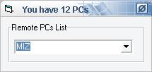



## LAN Scanner / Enumerator

### Description

The easy way to enumerate PCs' names in local network. List them in a combobox and count them. if you find this class helpful and useful, Please vote, comments are welcome. ;)
 
### More Info
 
List of Computers' names.

             |
---                |---
**Submitted On**   |2005-07-21 03:30:02
**By**             |[Mohammed Turky](https://github.com/Planet-Source-Code/PSCIndex/blob/master/ByAuthor/mohammed-turky.md)
**Level**          |Advanced
**User Rating**    |5.0 (15 globes from 3 users)
**Compatibility**  |VB 6\.0
**Category**       |[Miscellaneous](https://github.com/Planet-Source-Code/PSCIndex/blob/master/ByCategory/miscellaneous__1-1.md)
**World**          |[Visual Basic](https://github.com/Planet-Source-Code/PSCIndex/blob/master/ByWorld/visual-basic.md)
**Archive File**   |[LAN\_Scanne1915807212005\.zip](https://github.com/Planet-Source-Code/mohammed-turky-lan-scanner-enumerator__1-61827/archive/master.zip)

